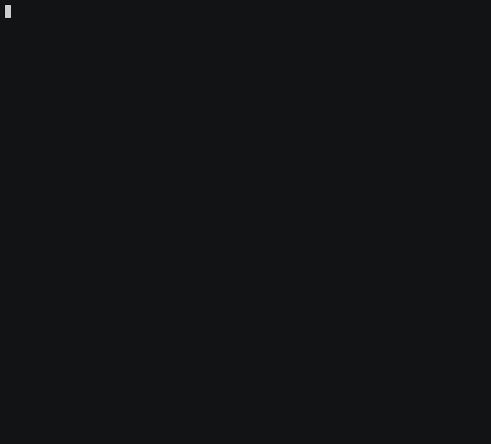

<section class="hero">
  <div class="hero-body">
    <p class="title">
      SILG: The Multi-environment Symbolic Interactive Language Grounding Benchmark
    </p>
    <p class="subtitle">
      <a href="//victorzhong.com">Victor Zhong</a>,
      <a href="//">Hanjie Austin Wang</a>,
      <a href="//www.sidaw.xyz">Sida Wang</a>,
      <a href="//www.cs.princeton.edu/~karthikn">Karthik Narasimhan</a>,
      <a href="//www.cs.washington.edu/people/faculty/lsz">Luke Zettlemoyer</a>
      <br />
      <a href="//nips.cc/Conferences/2021">NeurIPS 2021</a>
    </p>
    <p>
      <a class="button is-dark" href="">Paper</a>
      <a class="button is-dark" href="//github.com/vzhong/silg">Github</a>
    </p>
  </div>
</section>

Existing work in language grounding typically study single environments. How do we build unified models that apply across multiple environments? We propose the multi-environment Symbolic Interactive Language Grounding benchmark (SILG), which unifies a collection of diverse grounded language learning environments under a common interface. SILG consists of grid-world environments that require generalization to new dynamics, entities, and partially observed worlds (RTFM, Messenger, NetHack), as well as symbolic counterparts of visual worlds that re- quire interpreting rich natural language with respect to complex scenes (ALFWorld, Touchdown). Together, these environments provide diverse grounding challenges in richness of observation space, action space, language specification, and plan com- plexity. In addition, we propose the first shared model architecture for RL on these environments, and evaluate recent advances such as egocentric local convolution, recurrent state-tracking, entity-centric attention, and pretrained LM using SILG. Our shared architecture achieves comparable performance to environment-specific architectures. Moreover, we find that many recent modelling advances do not result in significant gains on environments other than the one they were designed for. This highlights the need for a multi-environment benchmark. Finally, the best models significantly underperform humans on SILG, which suggests ample room for future work. We hope SILG enables the community to quickly identify new methodolo- gies for language grounding that generalize to a diverse set of environments and their associated challenges.


<div class="columns">
  <div class="column">
    <p>RTFM</p>
    
    <p>Messenger</p>
    
    <p>SILGNethack</p>
    
  </div>
  <div class="column">
    <p>ALFWorld</p>
    
    <p>SymTD</p>
    
  </div>
</div>


# Get started

First, install the SILG environments.

```bash
# install SILG environments
wget -O - https://raw.githubusercontent.com/vzhong/silg/main/install_envs.sh | bash
# to get latest, pip install https://github.com/vzhong/silg
pip install silg
```

Then, in python:
```python
from silg import envs
import gym

td = gym.make('silg:td_segs_train-v0')
```

For more detailed instructions, including Docker access, please see [our Github](https://github.com/vzhong/silg).


# Citation

If you find this work helpful, please considering citing:

```
@inproceedings{ zhong2021silg,
  title={ {SILG}: The Multi-environment Symbolic Interactive Language Grounding Benchmark },
  author={ Victor Zhong and H. J. Austin Wang and Karthik Narasimhan and Luke Zettlemoyer },
  booktitle={ NeurIPS },
  year={ 2021 }
}
```

If you use SILG, please also cite the included environments
[RTFM](https://github.com/facebookresearch/RTFM),
[Messenger](https://github.com/ahjwang/messenger-emma/),
[the NetHack Learning Environment](https://github.com/facebookresearch/nle),
[ALFWorld](https://alfworld.github.io/),
and
[Touchdown](https://github.com/lil-lab/touchdown).


# Runs on SILG

If you use SILG for your work, please [add yourself](https://github.com/vzhong/silg/edit/docs/docs/index.md) to the following list for others to reference.

- [SILG: The Multi-environment Symbolic Interactive Language Grounding Benchmark]()
